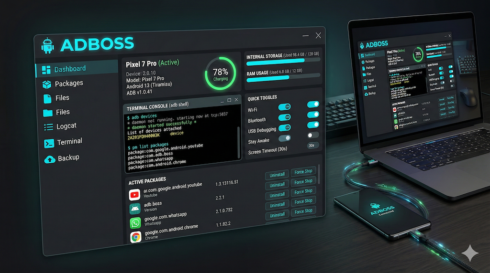

# ADBOSS

**Android Debug Bridge Desktop Manager** — A PySide6/Qt6 desktop application for controlling Android devices via ADB.

<p align="center">
  
</p>

ADBOSS provides a unified control panel for device monitoring, system settings, app management, file transfer, shell access, live logcat viewing, input remote control, and Android settings browsing — all from a single dark-themed GUI.

<p align="center">


-success?style=flat-square)


</p>

---

## Features

### Dashboard
Real-time device overview with auto-refresh (configurable, default 5s):
- **Device Info** — Model, Manufacturer, Android Version, Build ID, SDK, Serial, Uptime
- **Battery Gauge** — Circular arc visualization with color coding (green >50%, yellow >20%, red ≤20%), plus temperature, voltage, health, charging status
- **RAM & Storage Bars** — Horizontal progress bars with used/total display and color-coded thresholds
- **Network Info** — WiFi SSID, IP address, signal strength (dBm)
- **Display Info** — Resolution and DPI

### Device Control
- **Battery Simulation** — Slider (0–100) to fake battery level for testing, with reset to real values
- **Brightness** — Slider (0–255), applies on release, auto-disables adaptive brightness
- **Volume** — Three independent sliders for Media, Ringtone, and Alarm streams (0–15)
- **Toggles** — WiFi, Bluetooth, Airplane Mode, Do Not Disturb (on/off buttons with state display)
- **Screen** — Wake, Sleep, Lock buttons + screen timeout dropdown (15s to 30min)
- **Developer Options** — Layout Bounds and GPU Overdraw toggles

### App Manager
- **Searchable Package Table** — Package name, version, install date; filterable by name
- **System App Filter** — Toggle visibility of system packages
- **App Actions** — Launch, Force Stop, Uninstall (with confirmation), Clear Data
- **Enable/Disable** — Disable bloatware without uninstalling (via context menu)
- **Permissions Dialog** — View all app permissions, grant/revoke with checkboxes
- **APK Install** — File picker dialog or drag & drop `.apk` files onto the tab
- **Background Loading** — Package list loads in a background thread

### File Transfer
- **Dual-Pane Browser** — Device (remote) on the left, Desktop (local) on the right, resizable splitter
- **Navigation** — Editable path bar, Up button, double-click to enter directories
- **Push & Pull** — Buttons for explicit transfer, or drag & drop files between panels
- **Progress Bar** — Real-time transfer progress parsed from ADB stderr
- **Screenshot** — Capture device screen, save as PNG, preview in popup dialog
- **Screen Recording** — Start/Stop recording to `/sdcard/record.mp4` with elapsed time display
- **Path Memory** — Last used local and remote paths are persisted across sessions

### ADB Shell
- **Terminal Emulator** — Dark background, JetBrains Mono font, color-coded output
- **Command History** — Up/Down arrow navigation, stores last 100 commands
- **Timestamps** — Every command and output block is timestamped
- **Quick Actions** — One-click buttons for Reboot, Bootloader, Recovery, getprop, ps, df
- **Non-blocking** — Commands execute in a background thread

### Logcat Viewer
- **Live Streaming** — Real-time logcat output via background thread
- **High Performance** — QPlainTextEdit with QSyntaxHighlighter, batch rendering (50ms flush), no HTML overhead
- **Color Coding** — Verbose (gray), Debug (blue), Info (green), Warning (yellow), Error (red), Fatal (purple)
- **Monospaced Font** — JetBrains Mono with fallback chain (Fira Code, Source Code Pro, Menlo, Consolas)
- **Filters** — Log level dropdown, tag filter, PID filter, free-text search — all combinable
- **Pause/Resume** — Pause display while buffering continues
- **Smart Auto-Scroll** — Scroll up to freeze viewport, scroll to bottom to re-follow; trimming suspended while browsing to prevent content drift
- **Font Size** — Adjustable via spinner (7–24 px)
- **Line Wrap** — Toggleable word wrap
- **Buffer Limit** — Configurable max lines (1,000–100,000), oldest lines trimmed automatically
- **Rate Indicator** — Shows lines-per-flush for throughput monitoring
- **Export** — Save buffered logcat to `.txt` file

### Input Remote Control
- **Navigation Keys** — Home, Back, Recent Apps, Volume Up/Down/Mute, Power, Menu, Tab
- **D-Pad** — Arrow keys (Up/Down/Left/Right) with center OK/Enter button
- **Text Input** — Type text and send to device via `adb shell input text`; press Enter key separately
- **Tap** — Send screen tap to arbitrary X/Y coordinates (0–9999)
- **Swipe** — Define start/end coordinates and duration (50–5000ms) for swipe gestures
- **Three-Panel Layout** — Navigation, Text, and Touch controls in a resizable QSplitter

### Settings Browser
- **Namespace Selector** — Browse `system`, `secure`, and `global` Android settings
- **Live Search** — Filter settings by key name in real time
- **Sortable Table** — Click column headers to sort alphabetically by key or value
- **Inline Editing** — Double-click any row to populate the edit fields below
- **Set Value** — Modify any setting with key/value input and one-click apply
- **Background Loading** — Settings are loaded in a QThread to keep the UI responsive
- **Auto-Refresh** — Table reloads automatically after setting a value

### WiFi ADB
- **WiFi Connect Button** — Directly in the device selector header bar
- **Connect Dialog** — Enter IP address and port (default 5555) to connect wirelessly
- **IP Auto-Detection** — Prefills the device's IP address when a USB device is connected
- **Enable TCP/IP** — One-click button to switch a USB-connected device to WiFi mode (`adb tcpip 5555`)
- **Disconnect** — Cleanly disconnect wireless devices
- **Seamless Integration** — WiFi devices appear in the device dropdown like USB devices

### Keyboard Shortcuts

| Shortcut | Action |
|----------|--------|
| `Cmd+1` … `Cmd+8` | Switch to tab 1–8 (Dashboard, Control, Apps, Files, Shell, Logcat, Input, Settings) |
| `Cmd+R` | Context-dependent refresh (Dashboard, Apps, Files, or Settings reload) |
| `Cmd+L` | Toggle Logcat start/stop |
| `Cmd+K` | Clear Logcat output |
| `Cmd+Shift+S` | Take screenshot (Files tab) |
| `Cmd+Q` | Quit application |

All shortcuts are accessible via the menu bar (File, View, Tools) and work globally regardless of which tab is active.

### General
- **Dark Theme** — Full QSS stylesheet (470+ lines) with cyan (#00BCD4) accent color
- **Multi-Device** — Device selector dropdown with auto-detection (polls every 3s)
- **WiFi & USB** — Connect devices via USB cable or wirelessly over WiFi ADB
- **Status Bar** — Connection status, last action result, copyright
- **Responsive** — Freely resizable, minimum 900x600, window size persisted
- **Graceful Shutdown** — All threads, timers, and subprocesses cleaned up on exit

---

## Screenshots

### Dashboard
Real-time device info, battery gauge, RAM/storage bars, network and display info.

<p align="center">
  
</p>

### Device Control
Battery simulation, brightness, volume sliders, toggles, screen controls, developer options.

<p align="center">
  
</p>

### App Manager
Searchable package list with launch, force stop, uninstall, clear data, and permissions management.

<p align="center">
  
</p>

### File Transfer
Dual-pane browser with push/pull, screenshot capture, and screen recording.

<p align="center">
  
</p>

### ADB Shell
Terminal with command history, quick action buttons, and timestamped output.

<p align="center">
  
</p>

### Logcat Viewer
Live streaming with level/tag/PID filters, color-coded output, and smart auto-scroll.

<p align="center">
  
</p>

---

## Prerequisites

- **Python 3.11+**
- **ADB** installed and in your PATH (or configured manually in `~/.adboss/config.json`)
- **USB Debugging** enabled on your Android device

### Installing ADB

**macOS** (via [Homebrew](https://brew.sh)):
```bash
# Install Homebrew if not already installed:
/bin/bash -c "$(curl -fsSL https://raw.githubusercontent.com/Homebrew/install/HEAD/install.sh)"

# Install ADB:
brew install android-platform-tools
```

> **Note:** macOS does not have `apt`. If you see _"Unable to locate a Java Runtime that supports apt"_, you need Homebrew (above) instead.

**Ubuntu/Debian:**
```bash
sudo apt install android-tools-adb
```

**Windows** (via [Scoop](https://scoop.sh)):
```bash
scoop install adb
```

Verify installation: `adb version`

---

## Installation

There are two ways to install ADBOSS: as a standalone macOS app or in developer mode from source.

### Option A: Pre-built App (Standalone)

Download the latest release from [GitHub Releases](https://github.com/pepperonas/adboss/releases):

| Platform | Architecture | File |
|----------|-------------|------|
| macOS | Apple Silicon (M1/M2/M3/M4) | `adboss-macos-arm64.zip` |
| macOS | Intel | `adboss-macos-x86_64.zip` |
| Linux | x86_64 | `adboss-linux-x86_64.tar.gz` |
| Windows | x64 | `adboss-windows-x64.zip` |

**macOS:** Unzip, move `ADBOSS.app` to `/Applications/`, launch from Spotlight or Launchpad.
**Linux:** Extract tarball, run `./ADBOSS`.
**Windows:** Unzip, run `ADBOSS.exe`.

### Option B: Install from Source

```bash
git clone https://github.com/pepperonas/adboss.git
cd adboss
python3 -m venv venv
source venv/bin/activate    # Windows: venv\Scripts\activate
pip install -r requirements.txt
```

Run the app:

```bash
source venv/bin/activate
python main.py
```

Connect your Android device via USB (with USB Debugging enabled) or use the WiFi button in the device selector to connect wirelessly. ADBOSS will detect the device automatically within 3 seconds.

---

## Developer Mode

Developer mode lets you run ADBOSS directly from source with full debug logging, hot-reload capabilities, and access to all internal tooling. This is the recommended setup for contributing or debugging.

### Setup

```bash
# Clone and enter the project
git clone https://github.com/pepperonas/adboss.git
cd adboss

# Create and activate virtual environment
python3 -m venv venv
source venv/bin/activate    # Windows: venv\Scripts\activate

# Install runtime + dev dependencies
pip install -r requirements.txt
pip install -r requirements-dev.txt
```

### Running in Developer Mode

```bash
# Activate the virtual environment
source venv/bin/activate

# Run with full debug logging to stdout
python main.py
```

All ADB commands are logged at DEBUG level to the terminal, so you can see exactly what ADBOSS sends to the device:

```
2026-03-01 14:30:12 [DEBUG] core.adb_client: ADB: adb -s R5CN20XXXXX shell getprop ro.product.model
2026-03-01 14:30:12 [DEBUG] core.adb_client: ADB: adb -s R5CN20XXXXX shell dumpsys battery
```

### Verifying Imports (No Device Required)

Quick sanity check that all modules load correctly:

```bash
python -c "from ui.main_window import MainWindow; print('OK')"
```

### Running Tests

```bash
# Run all tests
pytest

# Run with coverage report
pytest --cov=. --cov-report=term-missing

# Run a specific test file
pytest tests/test_helpers.py -v
```

### Building the macOS App

To build a standalone `.app` bundle using PyInstaller:

```bash
# Install PyInstaller (if not already)
pip install pyinstaller

# Build the app
pyinstaller --name "ADBOSS" \
  --windowed \
  --icon assets/icon.icns \
  --add-data "assets:assets" \
  --noconfirm \
  main.py

# The app is created at dist/ADBOSS.app
```

Or use the existing spec file for reproducible builds:

```bash
pyinstaller ADBOSS.spec --noconfirm
```

Install the built app:

```bash
cp -R dist/ADBOSS.app /Applications/
```

### Adding Features

1. **New ADB command** — Add a method to `core/adb_client.py`, add a parser to `utils/helpers.py` if needed
2. **New UI control** — Add to the appropriate tab, use the `self._run(label, self._adb.method, args)` pattern for error handling + status bar feedback
3. **New tab** — Create `ui/new_tab.py` following the existing pattern (`status_message = Signal(str)`, `set_adb()` method), register it in `ui/main_window.py`
4. **New config key** — Add default to `DEFAULT_CONFIG` in `utils/config.py`
5. **Long-running operation** — Must use QThread with signal emission, never block the GUI thread

### Code Conventions

- Every tab has a `status_message = Signal(str)` connected to the main window status bar
- Tabs are independent; they share state only through the injected `ADBClient` instance
- All ADB interaction goes through `ADBClient` — never call `subprocess` for ADB elsewhere
- Version single source of truth: `version.py`
- QSS theming in `assets/styles.qss`, accent color `#00BCD4`
- Copyright: `(c) 2026 Martin Pfeffer | celox.io`

---

## Project Structure

```
adboss/
├── main.py                         # Entry point
├── version.py                      # Semantic version (single source of truth)
├── ADBOSS.spec                     # PyInstaller build spec
├── requirements.txt                # PySide6 (runtime)
├── requirements-dev.txt            # pytest, pytest-cov (development)
├── assets/
│   ├── banner.png                  # README banner image
│   ├── icon.png                    # App icon (PNG, 256x256)
│   ├── icon.icns                   # App icon (macOS format)
│   ├── styles.qss                  # Dark theme stylesheet (470+ lines)
│   └── screenshots/                # README screenshots
├── core/
│   ├── adb_client.py               # ADB wrapper (54 methods, all subprocess calls)
│   ├── device_monitor.py           # QThread for periodic device stats
│   └── file_transfer.py            # QThread for push/pull with progress
├── ui/
│   ├── main_window.py              # Main window, tabs, menu, shortcuts, status bar
│   ├── dashboard_tab.py            # Device info, battery gauge, storage bars
│   ├── control_tab.py              # Brightness, volume, toggles, screen
│   ├── apps_tab.py                 # Package list, install, permissions
│   ├── files_tab.py                # Dual-pane file browser, drag & drop
│   ├── shell_tab.py                # ADB shell terminal
│   ├── logcat_tab.py               # Live logcat with highlighter & filters
│   ├── input_tab.py                # Remote control: keys, text, tap, swipe
│   ├── settings_tab.py             # Android settings browser (system/secure/global)
│   └── widgets/
│       ├── battery_widget.py       # Circular gauge (custom QPainter)
│       ├── storage_widget.py       # Labeled progress bar
│       └── device_selector.py      # Device dropdown + WiFi ADB connect
├── utils/
│   ├── config.py                   # JSON config (~/.adboss/config.json)
│   └── helpers.py                  # ADB output parsers (10 parse functions)
└── tests/                          # Test suite (pytest)
```

---

## Architecture

### ADB Wrapper

All ADB interaction goes through `core/adb_client.py`. No raw `subprocess` calls exist elsewhere. The `ADBClient` class:

- Automatically prefixes `adb -s <serial>` for multi-device support
- Enforces per-command timeouts (10s default, up to 600s for backups)
- Returns empty strings on failure instead of raising exceptions
- Delegates all output parsing to pure functions in `utils/helpers.py`

### Threading

The GUI thread never blocks. Six worker types handle ADB I/O:

| Worker | Type | Purpose |
|--------|------|---------|
| `DeviceMonitor` | One-shot QThread | Collects all dashboard stats per refresh cycle |
| `FileTransferWorker` | Long-running QThread | Push/Pull with real-time progress |
| `PackageLoader` | One-shot QThread | Loads package list with version info |
| `ShellWorker` | One-shot QThread | Executes single shell commands |
| `LogcatReader` | Long-running QThread | Streams logcat lines continuously |
| `SettingsLoaderThread` | One-shot QThread | Loads Android settings by namespace |

All thread-to-UI communication uses Qt signals/slots.

### Logcat Rendering Pipeline

The logcat viewer uses a high-performance rendering pipeline optimized for high-throughput log streams:

1. **LogcatReader** (QThread) — Reads lines from `adb logcat` via `subprocess.Popen`
2. **Line buffer** — Incoming lines are filtered (level, tag, PID, text) and queued in `_pending`
3. **Flush timer** (60ms QTimer) — Joins queued lines into a single text block and inserts at cursor end
4. **LogcatHighlighter** (QSyntaxHighlighter) — Colors each line using compiled regex and cached `QTextCharFormat` objects
5. **LogcatView** (QPlainTextEdit subclass) — Smart auto-scroll: disables trimming while viewport is frozen, re-enables on follow; deferred scroll restore to counter async Qt layout adjustments

### Configuration

Stored at `~/.adboss/config.json`, auto-created on first run:

| Key | Default | Description |
|-----|---------|-------------|
| `adb_path` | auto-detected | Path to ADB binary |
| `refresh_interval_ms` | 5000 | Dashboard refresh interval |
| `device_poll_interval_ms` | 3000 | Device detection polling |
| `window_width` / `window_height` | 1100 / 750 | Window size (persisted) |
| `logcat_max_lines` | 5000 | Logcat buffer limit |
| `shell_history_max` | 100 | Shell command history size |
| `last_local_path` | `$HOME` | File browser local path |
| `last_remote_path` | `/sdcard/` | File browser remote path |

---

## ADB Command Coverage

ADBOSS wraps **54 ADB commands** across 13 categories:

| Category | Commands | Examples |
|----------|----------|---------|
| Device Info | 9 | `getprop`, `dumpsys battery`, `/proc/meminfo`, `df`, `top`, `wm size/density`, `dumpsys wifi` |
| Device Control | 10 | `settings put system screen_brightness`, `media volume`, `svc wifi`, `input keyevent` |
| App Management | 12 | `pm list packages`, `pm install/uninstall`, `am force-stop`, `pm grant/revoke`, `pm clear` |
| File Transfer | 6 | `adb push/pull`, `screencap`, `screenrecord`, `ls -la` |
| Shell & Logcat | 2 | `adb shell`, `adb logcat` |
| Input Simulation | 4 | `input tap/swipe/text/keyevent` |
| WiFi ADB | 3 | `adb connect`, `adb disconnect`, `adb tcpip` |
| Settings | 3 | `settings list`, `settings get`, `settings put` |
| Backup | 1 | `adb backup` |
| Developer | 2 | `setprop debug.layout`, `setprop debug.hwui.overdraw` |
| Reboot | 1 | `adb reboot [bootloader\|recovery]` |
| Detection | 1 | `adb devices -l` |

---

## Theming

The dark theme is defined in `assets/styles.qss` with these design tokens:

| Role | Color | Preview |
|------|-------|---------|
| Background | `#1e1e1e` |  |
| Surface | `#252526` |  |
| Widget BG | `#2d2d2d` |  |
| Text | `#d4d4d4` |  |
| Muted | `#888888` |  |
| Accent | `#00BCD4` (Cyan) |  |
| Accent Dark | `#00838F` (Teal) |  |
| Success | `#4CAF50` (Green) |  |
| Warning | `#FFC107` (Amber) |  |
| Error | `#F44336` (Red) |  |
| Fatal | `#E040FB` (Purple) |  |

The stylesheet covers all Qt widgets (buttons, sliders, tabs, tables, trees, scrollbars, dialogs, menus, tooltips) for a consistent appearance.

### Monospaced Fonts

Terminal and logcat views use **JetBrains Mono** as primary font with automatic fallback:

```
JetBrains Mono → Fira Code → Source Code Pro → Menlo → Consolas → monospace
```

---

## Dependencies

| Package | Version | Purpose |
|---------|---------|---------|
| PySide6 | >= 6.6.0 | Qt6 GUI framework |
| PyInstaller | (dev, optional) | Build standalone macOS/Windows/Linux app |
| pytest | >= 7.0.0 (dev) | Test framework |
| pytest-cov | >= 4.0.0 (dev) | Test coverage reporting |

No external ADB libraries — all device communication uses Python's `subprocess` module for maximum control and transparency.

---

## License

MIT

---

**(c) 2026 Martin Pfeffer | [celox.io](https://celox.io)**
